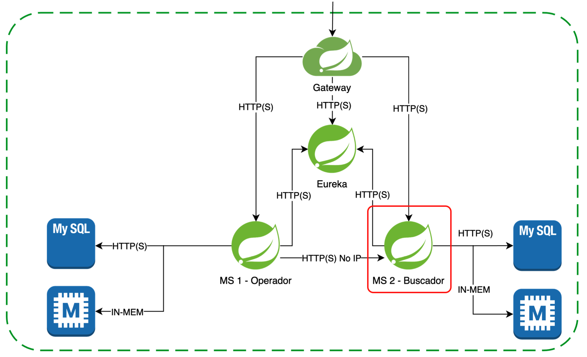

# E-Bass Store Products API V1

Esta API permite gestionar la información sobre los productos de una tienda de bajos eléctricos y accesorios,
permitiendo búsquedas y consultas, así como añadir, modificar o eliminar registros del catálogo. Tal como se muestra en
el siguiente diagrama, este microservicio está pensado para ser accesible a través de peticiones HTTP a un servidor
perimetral Spring Cloud Gateway y un servicio de descubrimiento Eureka. En este servicio de descubrimiento también está
registrada una API para gestionar los pedidos, por lo que podrá acceder a esta API simplemente conociendo el nombre del
host con el que se haya registrado sin necesidad de conocer su IP y puerto.

Los métodos que soporta son los siguientes sobre la URI principal `/api/v1/products`:

- Obtener la lista completa de productos mediante el método GET
- Buscar productos por uno o varios de sus atributos (`productRef`, `category`, `brand`, `model`, `description`
  y `price`) si se incluyen como query params en la URI.
- Obtener un producto concreto mediante el método GET, especificando en la URI su referencia `/{productRef}`
- Registrar un nuevo producto en el catálogo mediante el método POST, indicando sus datos en el cuerpo de la petición.
- Modificar los datos de un producto existente mediante el método PUT, especificando en la URI su
  referencia `/{productRef}` e indicando sus datos en el cuerpo de la petición.
- Modificar parcialmente los datos de un producto existente mediante el método PATCH, especificando en la URI su
  referencia `/{productRef}` e indicando los datos a modificar en el cuerpo de la petición.
- Eliminar un producto existente mediante el método DELETE, especificando en la URI su referencia `/{productRef}`.

| Método HTTP | URI                           | Query Params                                           | Cuerpo de la Petición                                                                                                                                                     | Cuerpo de la Respuesta                                                                                                                                                                                                                                                                                                                                                        | Códigos de Respuesta                                                       |
|-------------|-------------------------------|--------------------------------------------------------|---------------------------------------------------------------------------------------------------------------------------------------------------------------------------|-------------------------------------------------------------------------------------------------------------------------------------------------------------------------------------------------------------------------------------------------------------------------------------------------------------------------------------------------------------------------------|----------------------------------------------------------------------------|
| GET         | /api/v1/products              | N/A                                                    | N/A                                                                                                                                                                       | `[{"productRef": "B01", "category": "basses", "brand": "Fender", "model": "Precision Bass", "description": "Su diseño ergonómico y sonido firme lo convirieron en el estándar", "price": 1500.00}, {"productRef": "A01", "category": "amps", "brand": "Ampeg", "model": "SVT7 PRO", "description": "Amplificador de alta potencia y sonido vintage", "price": 1100.00}, ...]` | 200 OK 204 No Content 500 Internal Server Error                    |
| GET         | /api/v1/products              | productRef, category, brand, model, description, price | N/A                                                                                                                                                                       | `[{"productRef": "B01", "category": "basses", "brand": "Fender", "model": "Precision Bass", "description": "Su diseño ergonómico y sonido firme lo convirieron en el estándar", "price": 1500.00}]`                                                                                                                                                                           | 200 OK 204 No Content 500 Internal Server Error                    |
| GET         | /api/v1/products/{productRef} | N/A                                                    | N/A                                                                                                                                                                       | `{"productRef": "A01", "category": "amps", "brand": "Ampeg", "model": "SVT7 PRO", "description": "Amplificador de alta potencia y sonido vintage", "price": 1100.00}`                                                                                                                                                                                                         | 200 OK 204 No Content 500 Internal Server Error                    |
| POST        | /api/v1/products              | N/A                                                    | `{"productRef": "B02", "category": "basses", "brand": "Fender", "model": "Jazz Bass", "description": "El bajo más icónico y versátil de Fender", "price": 1299.99}`       | `{"productRef": "B02", "category": "basses", "brand": "Fender", "model": "Jazz Bass", "description": "El bajo más icónico y versátil de Fender", "price": 1700.00}`                                                                                                                                                                                                           | 200 OK 400 Bad Request 500 Internal Server Error                   |
| PUT         | /api/v1/products/{productRef} | N/A                                                    | `{"productRef": "B02", "category": "basses", "brand": "Music Man", "model": "Stingray", "description": "Reconocido por su sonido potente y distintivo", "price": 899.99}` | `{"productRef": "B02", "category": "basses", "brand": "Music Man", "model": "Stingray", "description": "Reconocido por su sonido potente y distintivo", "price": 2000.00}`                                                                                                                                                                                                    | 200 OK 400 Bad Request 404 Not Found 500 Internal Server Error |
| PATCH       | /api/v1/products/{productRef} | N/A                                                    | `{"price": "1900.00"}`                                                                                                                                                    | `{"productRef": "B02", "category": "basses", "brand": "Music Man", "model": "Stingray", "description": "Reconocido por su sonido potente y distintivo", "price": 1900.00}`                                                                                                                                                                                                    | 200 OK 400 Bad Request 404 Not Found 500 Internal Server Error |
| DELETE      | /api/v1/products/{productRef} | N/A                                                    | N/A                                                                                                                                                                       | N/A                                                                                                                                                                                                                                                                                                                                                                           | 204 No Content 404 Not Found 500 Internal Server Error             |

Los métodos no soportados devolverán un código de estado 405 Method Not Allowed.